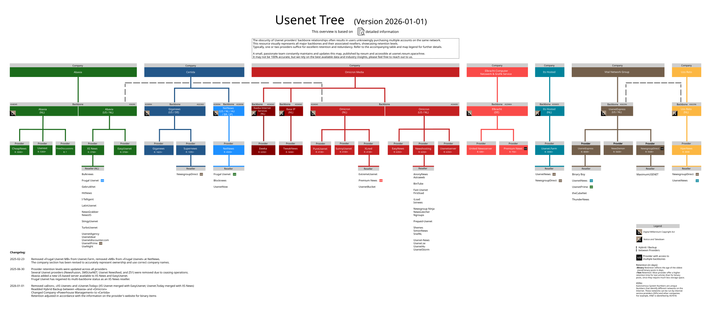

# 🎬 Marquee — A Self-Hosted Media Cinema

> A single-host, GPU-accelerated Plex media server with a fully automated acquisition
> pipeline, VPN-isolated torrent traffic, and zero-port-forward remote access over Tailscale.
> Built on Docker, orchestrated with Dockge, configured per the
> [TRaSH Guides](https://trash-guides.info/).

**Why "Marquee"?** A cinema's marquee is the lit sign out front — the only thing the public
sees. That's the whole security model here: a small, well-lit **front of house** that guests
reach, and a **back of house** (projection booth, film vault, couriers) that only staff touch.
The two Docker networks map directly onto that idea:

| Network | Role | "Cinema" analogy |
|---|---|---|
| `edge_net` | Front of house — anything the Tailscale doorman may reach | Lobby, box office, the screen |
| `backend_net` | Back of house — automation crew + management | Projection booth, vault, courier dock |

A handful of containers are **dual-homed** (on both networks) because they need to greet guests
*and* talk to the back office — Plex, seerr, and qui.

---

## Table of contents

1. [Host bring-up (OS, GPU, drivers)](#1-host-bring-up)
2. [Why Tailscale and not port forwarding](#2-why-tailscale-and-not-port-forwarding)
3. [Directory layout on the host](#3-directory-layout-on-the-host)
4. [The networking model](#4-the-networking-model)
5. [The four stacks](#5-the-four-stacks)
6. [The VPN sidecar (gluetun)](#6-the-vpn-sidecar-gluetun)
7. [How indexers and searching actually work](#7-how-indexers-and-searching-actually-work)
8. [Storage: hardlinks and instant moves](#8-storage-hardlinks-and-instant-moves)
9. [Permissions (PUID / PGID)](#9-permissions-puid--pgid)
10. [Plex tuning + the JBOPS 4K transcode killer](#10-plex-tuning--the-jbops-4k-transcode-killer)
11. [Request → stream: the full path flow](#11-request--stream-the-full-path-flow)
12. [Quick reference (ports & URLs)](#12-quick-reference)
13. [Rebuild / restore from scratch](#13-rebuild--restore-from-scratch)
14. [Backups & maintenance](#14-backups--maintenance)
15. [Credits & further reading](#15-credits--further-reading)
16. [Appendix: the Usenet backbone](#16-appendix-the-usenet-backbone)

---

## 1. Host bring-up

The base machine is one box running everything. Order of operations:

### 1.1 Ubuntu Server
A clean [Ubuntu Server](https://ubuntu.com/download/server) install. Headless, SSH only.
Everything below runs as a normal (non-root) user; note your UID/GID (see §9).

### 1.2 NVIDIA drivers
Install the proprietary NVIDIA driver so the GPU can do hardware transcoding:

```bash
sudo ubuntu-drivers autoinstall      # or install a specific version
sudo reboot
nvidia-smi                           # verify the GPU + driver are seen
```

### 1.3 NVIDIA patch — *optional on modern drivers* ⚠️
Historically, consumer GeForce cards had a **driver-imposed limit on simultaneous NVENC
encode sessions**, and the [keylase/nvidia-patch](https://github.com/keylase/nvidia-patch)
script removed it.

> **Fact-check / heads-up:** NVIDIA has quietly raised that cap several times — from 3 (2020)
> to **5 (March 2023)** to **8 (early 2024)**. So on a current driver you already get roughly
> 5–8 concurrent transcodes *without* patching. The patch only matters if you expect to exceed
> that. If you do apply it, remember it edits the driver library, so **you must re-run it after
> every driver update**, or transcoding silently reverts to the capped behaviour.

```bash
git clone https://github.com/keylase/nvidia-patch.git
cd nvidia-patch
sudo ./patch.sh            # removes the NVENC session cap
# sudo ./patch.sh -r       # rollback to the original driver lib
```

### 1.4 NVIDIA Container Toolkit
This is what actually lets a **Docker container** use the GPU. Without it, the `deploy`
block in Plex's compose file does nothing.

```bash
# Install per NVIDIA's guide, then:
sudo nvidia-ctk runtime configure --runtime=docker
sudo systemctl restart docker
# Verify a container can see the GPU:
docker run --rm --gpus all nvidia/cuda:12.4.0-base-ubuntu22.04 nvidia-smi
```

In Plex's compose this surfaces as:

```yaml
environment:
  - NVIDIA_VISIBLE_DEVICES=all
deploy:
  resources:
    reservations:
      devices:
        - driver: nvidia
          count: 1
          capabilities: [gpu, video]
```

> Plex hardware transcoding requires an active **Plex Pass**. Turn on *Use hardware
> acceleration when available* **and** *Use hardware-accelerated video encoding* in
> Plex → Settings → Transcoder.

---

## 2. Why Tailscale and not port forwarding

Port forwarding would have been simpler — but it's **impossible** on this connection.

Residential ISPs in India (and many elsewhere) put customers behind **CGNAT**
(Carrier-Grade NAT): many households share one public IPv4, so there is **no public
`IP:port` that maps back to this machine**. On top of that the ISP-supplied router is often
locked down and adds a second layer of NAT (**double NAT**). With CGNAT, inbound port
forwarding simply cannot work — there's nothing to forward *to*.

[Tailscale](https://tailscale.com/) sidesteps this entirely. It builds an **outbound-initiated,
WireGuard-based mesh** and uses NAT traversal (hole punching, with DERP relays as fallback) to
establish a direct encrypted tunnel **without any inbound port**. It effectively punches a hole
through the CGNAT. Bonus: nothing is ever exposed to the public internet — only devices signed
into *your* tailnet can reach the server, which is far safer than opening ports even if you
*could*.

So: **remote access = Tailscale.** Port forwarding isn't on the table.

---

## 3. Directory layout on the host

Two top-level folders at the root of the host filesystem: `/docker` (everything Docker) and
`/data` (all media + downloads). Keeping them on **one drive / one filesystem** is what makes
hardlinks and instant moves possible (see §8).

### `/docker` — compose, config, scripts

```
/docker/
├── appdata/                 # PERSISTENT config + databases, one folder per service
│   ├── bazarr/  flaresolverr/  gluetun/  plex/  prowlarr/
│   ├── qbittorrent/  qui/  radarr/  seerr/  sonarr/
│   ├── tailscale/  tautulli/   (← JBOPS scripts live here)  uptime-kuma/
│   └── …
├── compose/                 # one folder per STACK, each with its own .env
│   ├── plex/    { compose.yml, .env }
│   ├── starr/   { compose.yml, .env }
│   ├── tunnel/  { compose.yml, .env, nginx.conf }
│   └── util/    { compose.yml, .env }
├── README.md                # this file
└── scripts/
```

- **`compose/<stack>/`** — declarative source for each stack. This is what goes in Git.
- **`compose/<stack>/.env`** — secrets and host-specific vars (`TS_AUTHKEY`,
  `WIREGUARD_PRIVATE_KEY`, `PLEX_CLAIM`, …). Docker Compose auto-loads `.env` from the **same
  folder as the compose file** — it does *not* look in parent folders, which is exactly why
  there's one `.env` per stack. **These are git-ignored.**
- **`appdata/<service>/`** — runtime state each container writes (databases, configs,
  `MediaCover`, logs). **Never** versioned — it's state, not source.

> **Note for future-you:** the `util` stack sets `DOCKGE_STACKS_DIR=/opt/stacks`, but the
> actual compose files live in `/docker/compose`. Either point Dockge at `/docker/compose`
> (set `DOCKGE_STACKS_DIR=/docker/compose` and mount it the same on both sides) or symlink
> `/opt/stacks → /docker/compose`, otherwise Dockge won't see these stacks.

### `.gitignore` (what to keep out of the repo)

```gitignore
.env
**/.env
!**/.env.example
**/data/        # dockge's local ./data, etc.
```

---

## 4. The networking model

Two **external** Docker bridge networks connect everything. They're created once, outside any
single stack, so all four stacks can share them:

```bash
docker network create edge_net
docker network create backend_net
```

Every stack references them as `external: true`. Containers find each other by **hostname**
(Docker's embedded DNS at `127.0.0.11`), never by IP — so there are **no static IP
assignments to maintain**, and a container keeps the same name no matter what address it's
given on restart. This is why every service sets a `hostname:`.

### The two lanes

- **`edge_net` (front of house)** — only what the doorman is allowed to serve: `plex`,
  `tautulli`, `seerr`, `qui`, plus the Tailscale router.
- **`backend_net` (back of house)** — the automation crew + management: `sonarr`, `radarr`,
  `bazarr`, `prowlarr`/`qbittorrent`/`flaresolverr` (via gluetun), `dockge`, `uptime-kuma`,
  plus the gluetun gateway.
- **Dual-homed bridges** — `plex`, `seerr`, `qui` sit on **both**, because they must face
  guests *and* talk to the back office (e.g. seerr hands requests to Radarr/Sonarr; qui talks
  to qBittorrent behind the VPN).

> The split is a security boundary, not a performance one — all Docker networks are the same
> host bridge, so there's zero speed difference between lanes. It's **optional**: on a trusted
> single host you could run everything on one network. It earns its keep once a public ingress
> (Cloudflare) is added, so the public-facing plane genuinely can't reach the back office.

### The doorman: Tailscale + nginx sidecar

The clever bit. The `nginx-proxy` container uses
`network_mode: "service:tsrouterh52"`, which means **nginx inherits the Tailscale container's
entire network namespace** — they share one IP stack. So:

1. A remote user hits the **tailnet IP** on a service port (e.g. `:5055`).
2. The request arrives *inside* the Tailscale container's namespace, where **nginx is
   listening** on that port.
3. nginx proxies it by container name (`http://seerr:5055`) over `edge_net`.
4. The response travels back out the same path.

nginx only defines server blocks for **plex, tautulli, seerr, and qui** — so those are the
**only** four services a tailnet guest can reach. Everything else has no door from the
outside. (The `nginx.conf` lives in `compose/tunnel/` and is mounted read-only.)

### Two ways in

- **Away from home →** Tailscale → nginx → the four allowed services.
- **At home →** skip Tailscale entirely and hit `host-dns:port` on the LAN directly. Every
  service publishes its port to the host, so `http://server.lan:8989` reaches Sonarr, etc.
  This LAN exposure is **intentional** — it's convenience inside a trusted network.

> ⚠️ `dockge` mounts the Docker socket *and* is reachable on the LAN. Anyone who reaches its
> UI effectively has root on the host — give it a strong password and treat it accordingly.

### Cloudflare (planned)

`cloudflared` is stubbed out in the tunnel stack for future public access. When enabled, point
it at **subdomains** (not subpaths) and only at lightweight HTML apps like seerr. **Do not
stream Plex through the free Cloudflare tunnel** — proxying video that way violates Cloudflare's
ToS and gets throttled/blocked. Keep Plex on Tailscale + Plex's own remote access.

---

## 5. The four stacks

| Stack folder | Containers | Job |
|---|---|---|
| `tunnel` | `tsrouterh52` (Tailscale), `nginx-proxy` | The doorman / reverse proxy ingress |
| `plex` | `plex`, `tautulli`, `seerr` | The screen, the analytics, the requests desk |
| `starr` | `gluetunvpn`, `qbittorrent`, `qui`, `sonarr`, `radarr`, `prowlarr`, `bazarr`, `flaresolverr` | The acquisition pipeline |
| `util` | `dockge`, `uptime-kuma` | Stack management + uptime monitoring |

> Only **Sonarr (TV)**, **Radarr (movies)** and **Bazarr (subtitles)** are deployed today. The
> `books`, `music`, `photos`, `other` folders under `/data` exist so you can later drop in
> Readarr / Lidar etc. without restructuring.

---

## 6. The VPN sidecar (gluetun)

[gluetun](https://github.com/qdm12/gluetun) is a VPN-client-in-a-container. You give it your
provider (NordVPN here, WireGuard) and a private key, and it brings up the tunnel **inside the
container**. The smart part is **sidecar mode**:

```yaml
qbittorrent:
  network_mode: "service:gluetunvpn"   # qbit inherits gluetun's whole network
```

`qbittorrent`, `prowlarr`, and `flaresolverr` all set
`network_mode: "service:gluetunvpn"`. They have **no network of their own** — they *are*
gluetun's network. Consequences:

- **All their traffic exits through the VPN.** Torrent peers and indexer queries see the
  NordVPN exit IP, not your home IP — useful for privacy and for reaching trackers your ISP
  blocks.
- **Built-in kill switch.** If the tunnel drops, those containers lose all connectivity
  rather than leaking. Each also waits on `depends_on: { gluetunvpn: { condition:
  service_healthy } }`, so they won't even start until the VPN is up.
- **Ports are published on gluetun, not on the app.** qBittorrent's `8080`, Prowlarr's
  `9696`, FlareSolverr's `8191` are all opened in **gluetun's** compose, because that's the
  container that actually owns the network.
- **Same-namespace shortcut.** Because Prowlarr and FlareSolverr share gluetun's namespace,
  Prowlarr reaches FlareSolverr at `http://localhost:8191` — no cross-container DNS needed.

Meanwhile **Sonarr and Radarr stay OFF the VPN** (normal home internet) — they only talk to
the *arr ecosystem and the filesystem, and routing them through the VPN would just slow imports
and metadata lookups for no benefit.

> This is the elegant outcome: a VPN applied to *exactly* the services that need it, without
> installing a VPN on the host or routing the whole machine through it.

---

## 7. How indexers and searching actually work

This trips a lot of people up, so here's the precise mental model.

### Prowlarr is a manager, not a source
**Prowlarr** is an **indexer manager**. You add your torrent indexers (trackers) once in
Prowlarr, and it **syncs those indexer definitions to Sonarr and Radarr** automatically. You
never download *from* Prowlarr — the *arr apps query *through* it.

### Three different "searches" (the part people get wrong)

> **You had the right instinct, but it's not "automatic = RSS only."** There are actually
> three distinct mechanisms:

1. **RSS Sync (passive, scheduled ~every 15–60 min).** Sonarr/Radarr poll each indexer's RSS
   feed — a list of the *newest releases recently posted* (not personalised). They match that
   feed against your monitored/wanted list and grab anything that fits. This is how **brand-new
   releases** get picked up automatically over time. It only sees the **recent window**, so it
   will *never* surface an old back-catalogue release.

2. **Automatic Search (active, triggered on "add" / "search monitored" / scheduled).** This
   sends a real **search query** for the specific title to every indexer through Prowlarr — it
   **does** hit the full search API, not just RSS, so it *can* find older releases. **But** each
   candidate is run through your **Quality Profile + TRaSH Custom Format scoring + size
   limits**, and only a release that *passes* is grabbed. If nothing passes — or the indexers
   genuinely don't have it — **nothing downloads, silently.**

3. **Interactive Search (manual).** You click *Interactive Search* and see **every** candidate
   with size, seeders, age, and score — *including* the ones the decision engine would reject
   (with the rejection reason shown). You pick one yourself, overriding the automation.

**So the real distinction:** automatic search doesn't ignore the catalogue — it queries it, but
auto-rejects anything that fails your profile, which is why obscure/old titles often come back
empty and you reach for **Interactive Search** to grab a release manually (or override a worse
automatic pick). RSS is the separate passive stream that only ever sees what's *new*.

### Indexer proxies (FlareSolverr & VPN proxy)

In **Prowlarr → Settings → Indexers → Indexer Proxies** you can attach helpers, each given a
**Tag**; any indexer carrying that tag routes through the helper.

- **FlareSolverr** — a headless-browser challenge solver. Many trackers sit behind
  Cloudflare's "Just a moment…" anti-bot / JS challenge. FlareSolverr loads the page in a real
  browser, clears the challenge, and hands Prowlarr back valid cookies + user-agent so it can
  reach the indexer. Add it as an Indexer Proxy of type **FlareSolverr**, host
  `http://localhost:8191` (works because both share gluetun's namespace), tag it
  `flaresolverr`, then tag any indexer that fails its test with a Cloudflare error. See the
  [TRaSH FlareSolverr guide](https://trash-guides.info/Prowlarr/prowlarr-setup-flaresolverr/).

- **HTTP / VPN proxy** — routes an indexer's requests through a proxy (e.g. gluetun's built-in
  HTTP proxy) so the indexer connection egresses via the VPN, bypassing ISP/tracker blocks.
  **Not needed in this build** — because Prowlarr already lives *inside* the gluetun namespace,
  every query and grab is already going out through the VPN. (You'd only enable gluetun's
  `HTTPPROXY=on` and add it as an HTTP indexer proxy if you ever moved Prowlarr *out* of the
  VPN namespace.)

**Workflow:** add an indexer → **Test** → if it fails with a Cloudflare/blocked error, attach
the right proxy tag → **Test** again until it validates.

---

## 8. Storage: hardlinks and instant moves

All downloads and all media live under a single `/data` root on **one filesystem**. This is the
[TRaSH folder structure](https://trash-guides.info/File-and-Folder-Structure/), and it's what
makes imports **instant and space-free**.

```
/data/
├── media/                    # Plex library — mounted :ro into Plex
│   ├── books/
│   ├── movies/
│   ├── music/
│   ├── other/
│   ├── photos/
│   └── tv/
├── torrents/                 # qBittorrent download target (qbit sees ONLY this)
│   ├── books/
│   ├── movies/
│   ├── music/
│   ├── other/
│   ├── photos/
│   ├── torrents-files/       # the .torrent files themselves
│   └── tv/
└── usenet/                   # reserved for SABnzbd (currently disabled)
    ├── complete/
    │   ├── books/
    │   ├── movies/
    │   ├── music/
    │   ├── other/
    │   ├── photos/
    │   └── tv/
    └── incomplete/
        ├── books/
        ├── movies/
        ├── music/
        ├── other/
        ├── photos/
        └── tv/
```

### Why one root + matching subfolders matters

- **Hardlinks** require the source and destination to be on the **same filesystem**. Because
  `/data/torrents` and `/data/media` are the same fs, when Radarr/Sonarr import a finished
  download they create a **hardlink** — a second name pointing at the same data on disk. No
  copy, no extra space. The original stays in `torrents/` (so qBittorrent keeps **seeding**)
  while the library gets its own tidy path in `media/`.
- **Instant ("atomic") moves** — moving within one filesystem is just a rename of the inode,
  so it's instantaneous regardless of file size. No copy-then-delete.
- The **mirrored subfolder layout** (`torrents/movies` ↔ `media/movies`, etc.) gives a clean
  1:1 mapping for the root folders you configure in Radarr/Sonarr.

### Mount rules (and why)

| Container | Mount | Reason |
|---|---|---|
| `sonarr`, `radarr` | `/data` (whole, rw) | Must see **both** torrents + media under one mount to hardlink across them |
| `qbittorrent` | `/data/torrents` only | It only downloads/seeds — no reason to see the library |
| `bazarr` | `/data/media` | Only needs the finished library to drop subtitles beside videos |
| `plex` | `/data/media` (**ro**) | Reads the library; never mutates source files |

> **Critical:** in Radarr/Sonarr the download client's path and the root folder must resolve to
> the **same `/data` mount** the apps see — never mount `/data/torrents` and `/data/media`
> separately into the *arr apps, or hardlinking silently falls back to slow copies. See
> [TRaSH: Hardlinks and Instant Moves](https://trash-guides.info/Hardlinks/Hardlinks-and-Instant-Moves/).

---

## 9. Permissions (PUID / PGID)

The LinuxServer.io / hotio images run as a user you specify, via `PUID` and `PGID` env vars.
Set them to **your** user so every file a container creates is owned by you — no permission
friction on `/data`.

Find your IDs:

```bash
id
# uid=1000(shashank) gid=1000(shashank) groups=1000(shashank),...
```

Then every service gets:

```yaml
environment:
  - PUID=1000
  - PGID=1000
  - TZ=Asia/Kolkata
```

> **Keep PUID/PGID identical across *all* containers.** qBittorrent writes a file as `1000`,
> and Radarr (also `1000`) hardlinks it — if their UIDs differed, the link/import would hit
> permission errors. Uniform IDs are what let the whole pipeline share `/data` cleanly.

If you ever create a file as `root` from the terminal and a service can't read it (almost
always a permissions issue), fix ownership/mode to match your user:

```bash
sudo chown -R 1000:1000 /data/some/path
sudo chmod -R u+rwX,g+rwX /data/some/path
```

---

## 10. Plex tuning + the JBOPS 4K transcode killer

Plex setup follows the [TRaSH Guides](https://trash-guides.info/) — which is also where you
grab the **Custom Formats** you import straight into Radarr/Sonarr (so you don't hand-write
quality scoring rules):

- [TRaSH — Radarr custom formats](https://trash-guides.info/Radarr/Radarr-collection-of-custom-formats/)
- [TRaSH — Sonarr guides](https://trash-guides.info/Sonarr/)

### The 4K transcode problem

4K transcoding is the bane of home servers — it's brutally expensive on the GPU/CPU, and one
client "downgrading" a 4K stream can hammer the box. The fix is **JBOPS** (Just a Bunch Of
Plex Scripts) driven by a **Tautulli notification trigger**: when Tautulli sees a 4K transcode
start, it runs a script that **terminates the stream** and shows the user a message.

> **JBOPS:** <https://github.com/blacktwin/JBOPS> · script: `killstream/kill_stream.py`
> Full guide: [TRaSH — JBOPS 4K Transcode Stopping with Tautulli](https://trash-guides.info/Plex/Tips/4k-transcoding/)
> **Requires Plex Pass** (terminating streams is a Plex Pass feature).

### Install (the JBOPS folder already lives in `/docker/appdata/tautulli/JBOPS`)

```bash
cd /docker/appdata/tautulli
git clone https://github.com/blacktwin/JBOPS.git
# inside the Tautulli container this path is /config/JBOPS
```

Then in **Tautulli → Settings → Notification Agents → Add a new agent → Script**:

- **Script Folder:** `/config/JBOPS`
- **Script File:** `killstream/kill_stream.py`
- **Script Timeout:** `30`
- **Triggers:** ☑ Playback Start ☑ Playback Resume ☑ Transcode Decision Change
- **Conditions:**
  - `Video Decision` `is` `transcode`
  - `Video Resolution` `is` `4k`
  - Condition logic: `{1} and {2}`
- **Arguments** (paste under each enabled trigger):

```
--jbop stream --username {username} --sessionId {session_id} --killMessage 'Transcoding 4K is not allowed — please play a non-4K copy.'
```

Test by playing a 4K title and forcing a lower-quality stream; after a few seconds the stream
should stop and show your message. (The JBOPS `killstream` folder has more recipes — limiting
concurrent transcodes, per-user rules, Discord/Slack notifications, etc.)

---

## 11. Request → stream: the full path flow

Every application's role, from "I want a movie" to "it's playing on my screen":

```
                          ┌─────────────────────────────────────────────┐
                          │                  YOU (a user)                │
                          │   at home → LAN   |   away → Tailscale mesh   │
                          └───────────────┬───────────────┬─────────────-┘
                                          │               │
                away (WireGuard, no port-forward)         │  at home (host LAN)
                                          ▼               ▼
                               ┌────────────────────┐   direct host-dns:port
                               │ tsrouterh52 +      │   to ANY service
                               │ nginx-proxy        │
                               │ (edge doorman)     │
                               └─────────┬──────────┘
                          proxies ONLY: plex, tautulli, seerr, qui
                                          ▼
  (1) REQUEST            ┌────────────────────────────┐
  "I want Interstellar" →│  seerr  — requests desk    │
                          └──────────────┬─────────────┘
                                         │ approved request → the right *arr
                                         ▼
  (2) DECIDE             ┌────────────────────────────┐  applies Quality Profile
                          │  radarr (movies)           │  + TRaSH Custom Formats to
                          │  sonarr (tv)               │  pick the best release
                          └──────────────┬─────────────┘
                                         │ asks Prowlarr to search the indexers
                                         ▼
  (3) FIND               ┌────────────────────────────┐ solve  ┌────────────────────┐
                          │  prowlarr — indexer mgr    │───────▶│  flaresolverr      │
                          │  (inside gluetun VPN)      │ CF JS  │  (Cloudflare pass) │
                          └──────────────┬─────────────┘        └────────────────────┘
                                         │ best release handed back
                                         ▼
  (4) DOWNLOAD           ┌────────────────────────────┐  all torrent traffic exits
                          │  qbittorrent               │  the NordVPN tunnel:
                          │  (inside gluetun VPN) ──────┼──▶ NordVPN (WireGuard) ──▶ swarm
                          └──────────────┬─────────────┘
                                         │ writes to /data/torrents/movies
                                         ▼
  (5) FILE               ┌────────────────────────────┐  HARDLINK — instant, same fs,
                          │  radarr/sonarr import      │  no copy, original keeps seeding
                          │  /data/torrents ⇒ /data/media
                          └──────────────┬─────────────┘
                                         │ bazarr drops subtitles into /data/media
                                         ▼
  (6) SERVE              ┌────────────────────────────┐  scans library, transcodes via
                          │  plex  +  NVIDIA NVENC     │  GPU only if the client needs it
                          └──────────────┬─────────────┘
                                         │ the stream
                                         ▼
  (7) DELIVER     back out via nginx/Tailscale (away) or the LAN (home) → YOUR SCREEN
                  tautulli watches every play; JBOPS kills the stream if it's a 4K transcode
```

---

## 12. Quick reference

### Service ports (host LAN)

| Service | URL (LAN) | Tailnet (remote) |
|---|---|---|
| Plex | `http://server.lan:32400/web` | ✅ via nginx |
| Tautulli | `http://server.lan:8181` | ✅ via nginx |
| seerr | `http://server.lan:5055` | ✅ via nginx |
| qui (qBittorrent UI) | `http://server.lan:7476` | ✅ via nginx |
| Sonarr | `http://server.lan:8989` | ❌ LAN only |
| Radarr | `http://server.lan:7878` | ❌ LAN only |
| Bazarr | `http://server.lan:6767` | ❌ LAN only |
| Prowlarr | `http://server.lan:9696` | ❌ LAN only |
| qBittorrent (raw) | `http://server.lan:8080` | ❌ LAN only |
| FlareSolverr | `http://server.lan:8191` | ❌ LAN only |
| Dockge | `http://server.lan:5001` | ❌ LAN only |
| Uptime Kuma | `http://server.lan:3001` | ❌ LAN only |

### Secrets (per-stack `.env`)

| Stack | `.env` keys |
|---|---|
| `tunnel` | `TS_AUTHKEY`, (`TUNNEL_TOKEN` when cloudflared is enabled) |
| `starr` | `WIREGUARD_PRIVATE_KEY` |
| `plex` | `PLEX_CLAIM` (only needed for first claim; expires in ~4 min) |

---

## 13. Rebuild / restore from scratch

```bash
# 1. Host prep: Ubuntu + NVIDIA driver + Container Toolkit (see §1)

# 2. Create the shared external networks FIRST (compose expects them to exist):
docker network create edge_net
docker network create backend_net

# 3. Restore /docker/compose (this repo) and /docker/appdata (your config backups).
#    Recreate each stack's .env from your password manager.

# 4. Bootstrap Dockge once, then let it manage the rest:
cd /docker/compose/util && docker compose up -d
#    …or bring each stack up directly:
for s in tunnel plex starr util; do
  docker compose -f /docker/compose/$s/compose.yml up -d
done
```

Order notes: the external networks must exist **before** any `up`. The `tunnel` stack brings up
Tailscale (needs a fresh `TS_AUTHKEY` if `TS_AUTH_ONCE=true` and state was wiped).

---

## 14. Backups & maintenance

The media under `/data` is re-downloadable; the contents of `/docker/appdata` are not. The
*arr databases, Plex metadata, Tautulli history, and qBittorrent state are the irreplaceable
part of this build — and they all live on one drive, so that drive is a single point of
failure for everything that matters. Back it up.

### Backups

- **Built-in app backups (consistency-safe).** Sonarr, Radarr, and Prowlarr each write their
  own scheduled backups into `appdata/<app>/Backups/`. These are DB-consistent (taken while
  the app quiesces its database), so they're the safest source to restore from.
- **Full appdata snapshot (offsite copy).** A weekly `tar` of `/docker/appdata` to a second
  drive or remote host captures everything (including the app backups above):

```bash
  # /docker/scripts/backup-appdata.sh
  set -euo pipefail
  DEST=/mnt/backup                       # second drive, NAS, or rclone remote
  STAMP=$(date +%F)
  tar -czf "$DEST/appdata-$STAMP.tar.gz" -C /docker appdata
  # keep the last 14 snapshots, prune the rest
  ls -1t "$DEST"/appdata-*.tar.gz | tail -n +15 | xargs -r rm
```

```bash
  # crontab -e  — run nightly at 04:00
  0 4 * * * /docker/scripts/backup-appdata.sh >> /docker/scripts/backup.log 2>&1
```

  > For fully consistent SQLite snapshots of live containers, either rely on the *arr built-in
  > backups above, or briefly stop a stack before taring it. A live `tar` is usually fine for
  > recovery but can occasionally catch a database mid-write.

### Keep custom formats in sync — Recyclarr

Instead of re-importing TRaSH custom formats by hand whenever they change,
[Recyclarr](https://recyclarr.dev/) syncs them (and their quality scores) into Radarr/Sonarr
on a schedule from a single config file. Run it as a scheduled container or cron job.

### Maintenance checklist

- **Disk-space alert.** Add a monitor (Uptime Kuma push, or a notifier) for free space on
  `/data` — a full disk makes imports fail *silently*. This is the most common day-2 outage.
- **Tailscale MagicDNS + ACLs.** Enable MagicDNS to reach services at
  `plex.<your-tailnet>.ts.net:32400` instead of raw `100.x` IPs, and use tailnet ACLs to
  restrict which users/devices can reach this node.
- **Re-apply the NVENC patch after every NVIDIA driver update** (if you use it — see §1.3); the
  patch edits the driver library and is wiped by driver upgrades.
- **Rotate secrets if ever exposed.** Moving keys into `.env` hides them going forward, but a
  key that was ever pasted somewhere should be regenerated (Nord dashboard / Tailscale admin),
  not just relocated.
- **Optional: `/tmp/plex_transcode` on tmpfs (RAM)** for faster transcoding and less SSD wear,
  if you have spare memory:

```yaml
  # in the plex service
  tmpfs:
    - /transcode
```

---

## 15. Credits & further reading

- **TRaSH Guides** — the bible for this whole stack: <https://trash-guides.info/>
- **Servarr wiki** (Sonarr/Radarr/Prowlarr docs): <https://wiki.servarr.com/>
- **gluetun** (VPN sidecar): <https://github.com/qdm12/gluetun>
- **JBOPS** (Plex scripts, 4K killer): <https://github.com/blacktwin/JBOPS>
- **keylase/nvidia-patch** (NVENC session unlock): <https://github.com/keylase/nvidia-patch>
- **NVIDIA Container Toolkit**: <https://docs.nvidia.com/datacenter/cloud-native/container-toolkit/>
- **Tailscale**: <https://tailscale.com/>
- **Dockge**: <https://github.com/louislam/dockge>
- **LinuxServer.io image docs**: <https://docs.linuxserver.io/>

---

## 16. Appendix: the Usenet backbone

Kept here for reference — a map of Usenet providers and their backbones. Usenet predates the
modern web: a distributed discussion/broadcast network from the early internet era, whose
infrastructure is still used today as a download backbone (the path SABnzbd would take, hence
the reserved `/data/usenet` folders above).



---

*Built and documented for future-me. If something's broken, it's probably permissions — check
§9 first.* 🛠️

# Summary

Project name: Marquee. A marquee is the lit sign out front of a cinema — the only thing the public sees — which is exactly your security model: a small lit front of house (edge_net) guests reach, and a back of house (backend_net) only staff touch. It maps cleanly onto your two networks and reads well as a repo name. If it doesn't land, alternatives in the same vein: Reel, Nitrate, Picturehouse, Projection Booth.

Topology HTML is refreshed to match the real current state: renamed lanes, static IPs gone (hostname-based now), qui shown as a proper dual-homed bridge, gluetun off the edge, a new "request → stream" lifecycle strip, a GPU tag on Plex, and the findings flipped to green (the LAN exposure is now framed as intentional, secrets noted as externalized to .env).

This README covers — host/GPU bring-up, the CGNAT-vs-port-forward rationale, both /docker and /data trees, the networking + sidecar model, gluetun, storage/hardlinks, permissions, the JBOPS 4K killer with exact Tautulli config, the full ASCII request-flow diagram, a port/URL quick reference, a rebuild runbook, and the Usenet SVG embedded at the end.